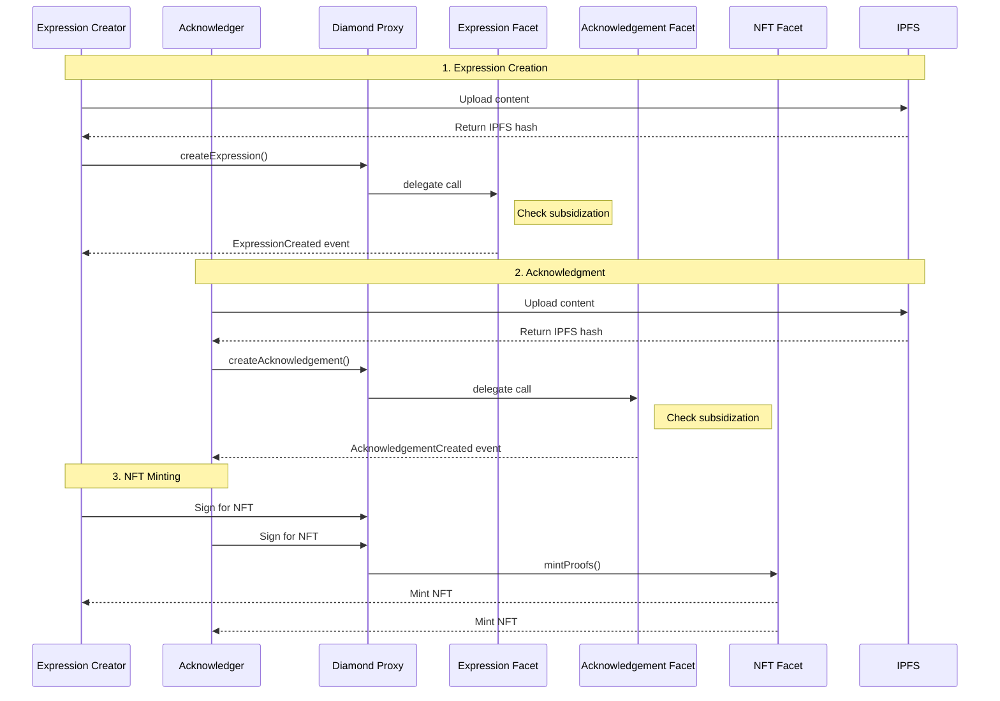
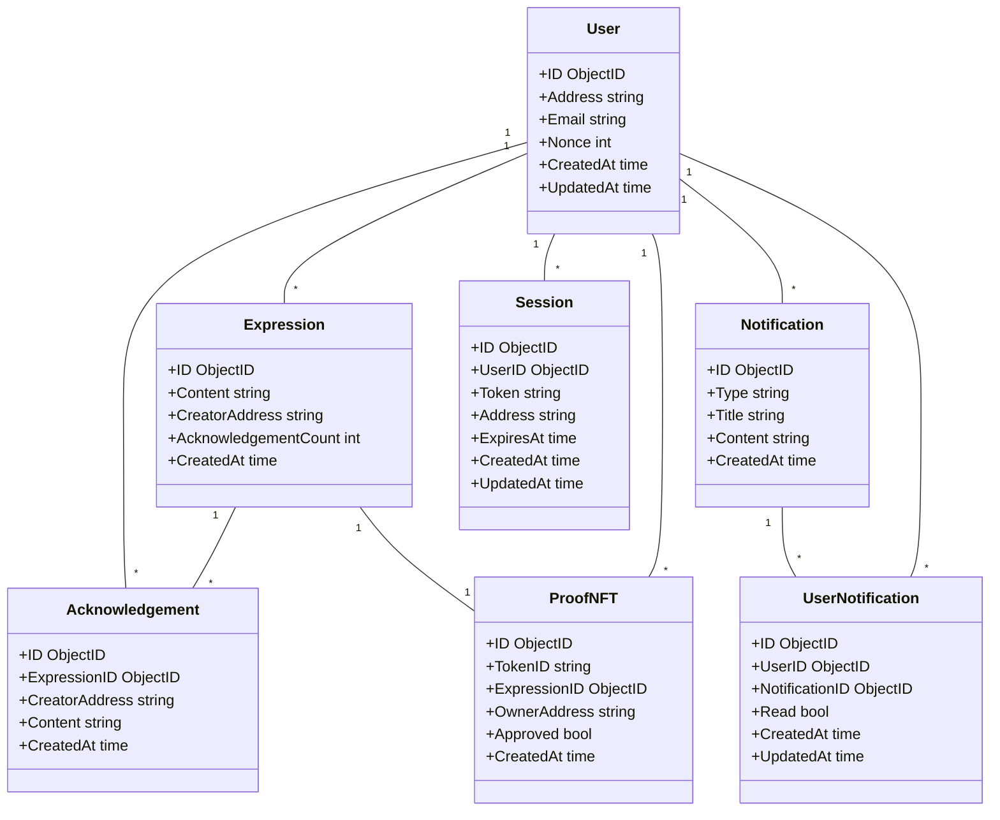

# Proof of Peacemaking

A decentralized platform for creating and acknowledging expressions of peace, with (optional) verifiable proof stored on the blockchain.

## Overview

Proof of Peacemaking is a Web3 platform that enables users to:
- Create expressions of peace on the blockchain
- Acknowledge and support peaceful resolutions
- Generate verifiable proof of agreements
- Earn soulbound NFTs for meaningful contributions

## Features

- **Wallet Integration**: Secure authentication with MetaMask
- **Expression Creation**: Share and document peaceful resolutions
- **Acknowledgements**: Support and verify expressions of peace
- **Activity Feed**: Real-time updates of community activity
- **User Dashboard**: Track personal contributions and stats
- **Proof NFTs**: Earn soulbound tokens for verified agreements


## Acknowledgments

- [Nick Mudge](https://github.com/mudgen) for his initiative, [Diamond Pattern (EIP-2535)](https://eips.ethereum.org/EIPS/eip-2535)
- The Ethereum community for blockchain infrastructure
- Protocol Labs for IPFS and Filecoin

- The Golang and Fiber communities for excellent tooling
- All contributors who have helped shape this project

## Tech Stack

### Backend
- **Language**: Go 1.21+
- **Framework**: Fiber (high-performance web framework)
- **Database**: MongoDB (for user data and sessions)
- **Authentication**: Ethereum wallet-based (MetaMask)

### Frontend
- **Core**: HTML5, CSS3, JavaScript
- **Web3**: ethers.js for blockchain interaction
- **Styling**: Custom CSS with responsive design

### Infrastructure
- **Blockchain**: Ethereum (Sepolia testnet)
- **Smart Contracts**: Solidity with Diamond Pattern
- **Storage**: IPFS for decentralized content

## Project Structure

```
proof-of-peacemaking/
├── cmd/                    # Application entrypoints
├── internal/              # Internal packages
│   ├── core/             # Core business logic
│   │   ├── domain/       # Domain models
│   │   ├── ports/        # Interfaces
│   │   └── services/     # Business logic implementation
│   ├── handlers/         # HTTP handlers
│   ├── middleware/       # HTTP middleware
│   └── repositories/     # Data access layer
├── web/                  # Web assets
│   ├── static/          # Static files (JS, CSS)
│   └── templates/       # HTML templates
├── contracts/           # Smart contracts
└── docs/               # Documentation
```

## Smart Contract Architecture

The project uses the Diamond Pattern for upgradeable and modular smart contracts:

```
contracts/
├── Diamond.sol                 # Main diamond contract
├── facets/
│   ├── DiamondCutFacet.sol    # Handles upgrades
│   ├── DiamondLoupeFacet.sol  # Contract inspection
│   ├── ExpressionFacet.sol    # Expression functionality
│   ├── AcknowledgementFacet.sol # Acknowledgement functionality
│   ├── POPNFTFacet.sol        # NFT minting functionality
│   └── PermissionsFacet.sol   # Permission management
├── libraries/
│   ├── LibDiamond.sol         # Diamond storage & core functions
│   ├── LibStorage.sol         # Shared storage structure
│   └── LibPermissions.sol     # Permission & subsidy logic
└── interfaces/
    ├── IDiamondCut.sol        # Diamond upgrade interface
    └── IDiamondLoupe.sol      # Diamond inspection interface
```

### Diamond Pattern Benefits

The Diamond Pattern provides several key advantages for our smart contract architecture:

1. **Storage Management**
   - Solves the contract size limitation (24KB)
   - Enables shared storage between facets
   - Provides structured storage patterns

2. **Modularity**
   - Separates concerns into focused facets
   - Enables independent testing and auditing
   - Simplifies maintenance and updates

3. **Upgradeability**
   - Allows adding new functionality
   - Enables bug fixes without redeployment
   - Preserves contract state during upgrades

4. **Gas Efficiency**
   - Optimizes function selector handling
   - Reduces deployment costs through reuse
   - Enables gas-optimized storage patterns

5. **Security**
   - Immutable core functionality
   - Granular access control
   - Transparent upgrade process

### Data Flow



### Facet Functionality

1. **ExpressionFacet**
   - Creates and stores expressions
   - Manages expression metadata
   - Emits events for frontend tracking

2. **AcknowledgementFacet**
   - Links acknowledgments to expressions
   - Prevents duplicate acknowledgments
   - Maintains acknowledgment history

3. **POPNFTFacet**
   - Creates soulbound NFTs
   - Manages dual-signature minting
   - Stores comprehensive metadata

4. **PermissionsFacet**
   - Manages operator permissions
   - Controls gas subsidization
   - Handles access control

## Domain Model



## Roadmap

### Current Status (Q4 2024)

✅ **Completed**
- Authentication system
  - MetaMask wallet integration
  - Email/password authentication
  - Session management
- User profile system
  - Profile customization
  - Wallet connection
  - Activity tracking
- Expression system foundation
  - Multimedia support (text, images, audio, video)
  - R2 storage integration
  - Content delivery optimization
- Smart contract architecture (Diamond Pattern)
- Basic feed implementation
  - Custom media players
  - Interactive UI components
  - Basic content listing
- Basic frontend structure
  - Responsive design
  - Dark mode support
  - Modern UI components

🚧 **In Progress**
- Expression system enhancement
  - Advanced media processing
  - Content moderation system
  - Expression categorization
  - Template-based creation
- Integration of third-party services
  - DocuSign for eSignatures
  - Canva API for certificate generation
  - Agreement template system
- Feed system enhancement
  - Real-time updates
  - WebSocket integration
  - Performance improvements
  - Enhanced filtering
  - Social features
- User dashboard enhancement
  - (maybe) Analytics integration (Google Analytics or Matomo)
  - Achievement tracking
  - Notification system
  - (maybe) CRM integration (Hubspot)

### Q1-Q2 2025 Planned

#### Core Features
- IPFS integration for content storage
- Expression system expansion
  - AI-assisted content creation
  - Collaborative editing
  - Version control
  - Rich text formatting
- Authentication enhancement
  - Passkey support (WebAuthn)
  - Cross-device synchronization
  - Biometric authentication
- KYC integration
  - Citizenship verification
  - Identity validation
  - Compliance management
- Acknowledgement system enhancement
  - Dual-signature verification
  - Acknowledgement types and categories
  - Reputation system
  - Smart verification flow

#### Smart Contracts
- Deploy Diamond proxy contract
- Implement and test facets:
  - Expression management
  - Acknowledgement handling
  - NFT minting
  - Permission management

#### Gas Subsidization
- Implement gas subsidization system
- Develop operator management
- Create sponsorship program
- Apply for ecosystem grants:
  - Ethereum Foundation
  - Protocol Labs
  - Web3 Foundation

#### Platform Growth
- Community building
  - Ambassador program
  - Educational content
  - Community events
- Partnership development
  - Peace organizations
  - Academic institutions
  - Web3 projects


### Q3 2025 Planned

#### Advanced Features
- Soulbound NFT implementation
  - Proof of peacemaking tokens
  - Achievement badges
  - Reputation tokens
- Advanced analytics
  - Peace impact metrics
  - Community engagement stats
  - Network effect analysis

#### Sustainability
- Grant applications
- Sponsorship programs
- Ecosystem fund
- Sustainable revenue model

### Q4 2025 and Beyond

#### Ecosystem Development
- Governance system
  - Community voting
  - Proposal system
  - Treasury management
- Integration possibilities
  - Cross-chain support
  - Layer 2 solutions
  - Other peace initiatives


### Gas Subsidization Strategy

To make the platform accessible to all users, we're implementing a comprehensive gas subsidization strategy:

1. **Target Groups**
   - Peace organizations
   - Academic institutions
   - Non-profit entities
   - Individual peacemakers
   - Developing region users

2. **Funding Sources**
   - Ecosystem grants
   - Corporate sponsorships
   - Foundation partnerships
   - Community treasury

3. **Implementation**
   - Smart contract operator system
   - Gas cost estimation
   - Usage limits and caps
   - Transparent reporting

4. **Sustainability**
   - Long-term partnerships
   - Renewable funding sources
   - Community governance
   - Impact metrics

### Get Involved

We're actively seeking:
- Contributors (technical and non-technical)
- Partners and sponsors
- Grant opportunities
- Community ambassadors

For collaboration opportunities, please:
- Check our [Contributing Guidelines](CONTRIBUTING.md)
- Join our [discord](https://discord.gg/sqjdyCWNAR)
- Contact us at contact@stateful.art

## Getting Started

### Prerequisites
- Go 1.21+
- MongoDB 6.0+
- Node.js 18+ (for contract development)
- MetaMask wallet

### Installation

1. Clone the repository
```bash
git clone https://github.com/stateful-art/proof-of-peacemaking.git
cd proof-of-peacemaking
```

2. Set up environment variables
```bash
cp .env.example .env
# Edit .env with your configuration
```

3. Install dependencies
```bash
go mod download
```

4. Run the application
```bash
go run cmd/server/main.go
```

The application will be available at `http://localhost:3003`

## Development

### Running Tests
```bash
go test ./...
```

### Smart Contract Development
```bash
cd contracts
npm install
npx hardhat test
```

## License

This project is licensed under the [GNU General Public License v3.0](LICENSE.md).


