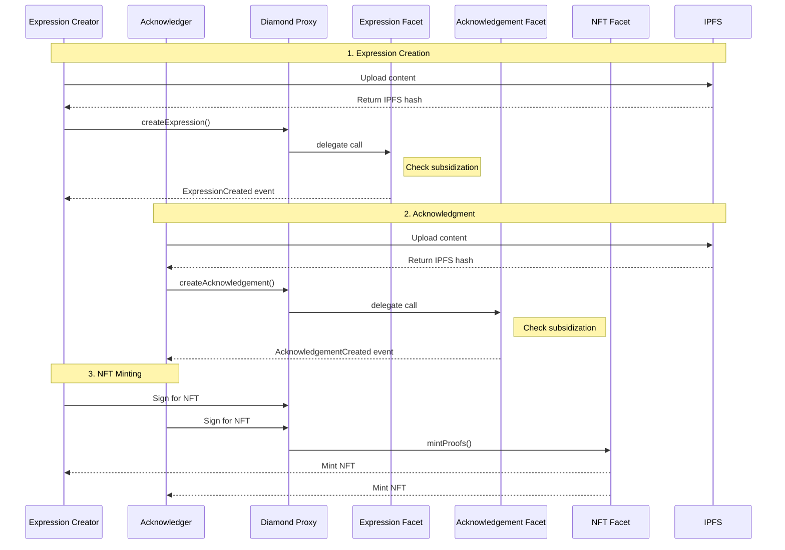

# Technical Documentation

This directory contains technical documentation for the Proof of Peacemaking project.

For general project information, installation instructions, and overview, please see the [main README](../README.md).

## Contents

### Smart Contract Architecture

The project uses the Diamond Pattern for upgradeable smart contracts:

```
contracts/
├── Diamond.sol                 # Main diamond contract
├── facets/
│   ├── DiamondCutFacet.sol    # Handles upgrades
│   ├── DiamondLoupeFacet.sol  # Contract inspection
│   ├── ExpressionFacet.sol    # Expression functionality
│   ├── AcknowledgementFacet.sol # Acknowledgement functionality
│   ├── POPNFTFacet.sol        # NFT minting functionality
│   └── PermissionsFacet.sol   # Permission management
├── libraries/
│   ├── LibDiamond.sol         # Diamond storage & core functions
│   ├── LibStorage.sol         # Shared storage structure
│   └── LibPermissions.sol     # Permission & subsidy logic
└── interfaces/
    ├── IDiamondCut.sol        # Diamond upgrade interface
    └── IDiamondLoupe.sol      # Diamond inspection interface
```

### Data Flow Diagrams

#### Expression Creation and Acknowledgement


### API Documentation

For detailed API documentation, see [API.md](API.md).

### Database Schema

For database schema documentation, see [DATABASE.md](DATABASE.md).

### Development Guidelines

For development guidelines and best practices, see [DEVELOPMENT.md](DEVELOPMENT.md).
