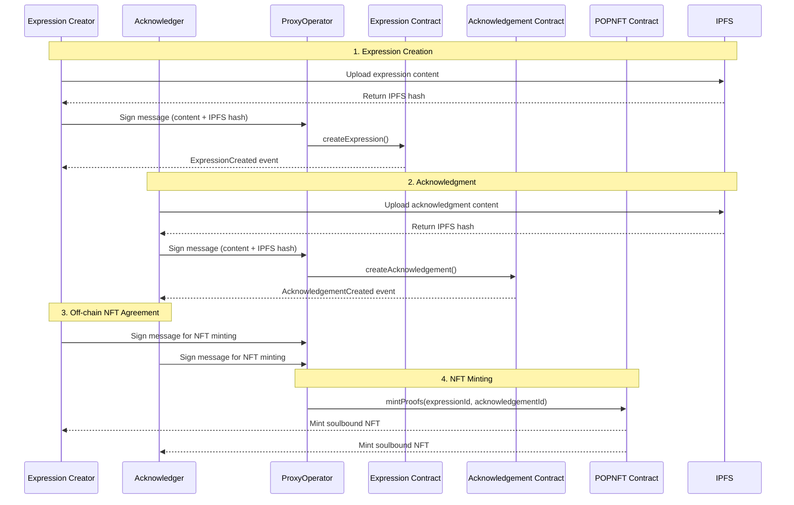

# Proof of Peacemaking

A decentralized platform for creating and acknowledging expressions of peace, with verifiable proof as soulbound NFTs.

## Architecture



## Components

### Smart Contracts

1. **Expression Contract**
   - Stores expressions of peace
   - Validates creators and content
   - Emits events for frontend tracking

2. **Acknowledgement Contract**
   - Links acknowledgments to expressions
   - Prevents duplicate acknowledgments
   - Maintains acknowledgment history

3. **POPNFT Contract**
   - Creates soulbound NFTs
   - Requires mutual agreement
   - Stores comprehensive metadata
   - References IPFS content

4. **ProxyOperator Contract**
   - Enables gasless transactions
   - Verifies user signatures
   - Executes operations on behalf of users
   - Prevents replay attacks

### IPFS Integration

All content is stored on IPFS:
- Expression multimedia (text, audio, video, image)
- Acknowledgment responses
- Supporting documentation
- NFT metadata and proofs

### Gas Subsidization

The proxy operator pattern enables:
- Gasless transactions for users
- Signature-based authorization
- Batched operations
- Cost management for platform operators

## Development Setup

1. **Prerequisites**
   ```bash
   # Install dependencies
   npm install

   # Install Hardhat globally
   npm install -g hardhat
   ```

2. **Environment Setup**
   ```bash
   # Copy example env file
   cp .env.example .env

   # Fill in required variables:
   # - ETHEREUM_RPC_URL
   # - IPFS_NODE
   # - CONTRACT_ADDRESS
   # - EMAIL_SERVICE_API_KEY
   ```

3. **Local Development**
   ```bash
   # Start local hardhat node
   npx hardhat node

   # Deploy contracts
   npx hardhat run scripts/deploy.js --network localhost

   # Run tests
   npx hardhat test
   ```

4. **Frontend Development**
   ```bash
   # Start development server
   go run cmd/server/main.go
   ```

## Deployment

1. **Contract Deployment Order**
   ```bash
   # 1. Deploy Expression contract
   npx hardhat run scripts/deploy-expression.js --network <network>

   # 2. Deploy Acknowledgement contract
   npx hardhat run scripts/deploy-acknowledgement.js --network <network>

   # 3. Deploy POPNFT contract
   npx hardhat run scripts/deploy-popnft.js --network <network>

   # 4. Deploy ProxyOperator contract
   npx hardhat run scripts/deploy-proxy.js --network <network>

   # 5. Set up contract relationships
   npx hardhat run scripts/setup-contracts.js --network <network>
   ```

2. **Contract Verification**
   ```bash
   # Verify on Etherscan
   npx hardhat verify --network <network> <contract-address> <constructor-args>
   ```

3. **Frontend Deployment**
   ```bash
   # Build frontend
   go build -o server cmd/server/main.go

   # Run with environment variables
   PORT=3003 ./server
   ```

## Security Considerations

1. **Smart Contract Security**
   - Soulbound NFT implementation
   - Signature verification
   - Nonce-based replay protection
   - Access control
   - Gas optimization

2. **Frontend Security**
   - Secure message signing
   - IPFS content verification
   - Network validation
   - Error handling

3. **Operational Security**
   - Proxy operator management
   - Gas subsidization limits
   - Content moderation capabilities
   - Emergency pause functionality

## Contributing

1. **Development Process**
   - Fork the repository
   - Create feature branch
   - Submit pull request
   - Pass CI/CD checks

2. **Testing Requirements**
   - Unit tests for contracts
   - Integration tests
   - Frontend testing
   - Gas optimization tests

3. **Documentation**
   - Update relevant README files
   - Add inline code comments
   - Update API documentation
   - Document frontend changes

4. **Code Style**
   - Follow Solidity style guide
   - Use Go formatting
   - Maintain consistent JS/HTML style
   - Document complex logic

## License

MIT License - see LICENSE file for details

## Contract Verification Checklist

### Contract Flow
- ✓ Expression creation through ProxyOperator
- ✓ Acknowledgement creation through ProxyOperator
- ✓ Off-chain dual signatures for NFT minting
- ✓ Single transaction NFT minting by ProxyOperator

### Contract Features
- ✓ Expression.sol: Multimedia content via IPFS hashes
- ✓ Acknowledgement.sol: Links to expressions, no self-acknowledgments
- ✓ POPNFT.sol: Soulbound tokens, dual-minting, metadata storage
- ✓ ProxyOperator.sol: Signature verification, nonce tracking

### Gas Subsidization
- ✓ All operations can be subsidized
- ✓ Proxy operator handles all on-chain transactions
- ✓ Users only sign messages

### Security Model
- ✓ Nonce-based replay protection in ProxyOperator
- ✓ Soulbound implementation in POPNFT
- ✓ Access controls for proxy operations
- ✓ Signature verification for all operations

## IPFS Data Structure

### Expression Content
```json
{
  "expression": {
    "text": "ipfs://Qm...",
    "audio": "ipfs://Qm...",
    "video": "ipfs://Qm...",
    "image": "ipfs://Qm...",
    "metadata": {
      "timestamp": "2024-01-01T00:00:00Z",
      "creator": "0x...",
      "title": "Expression of Peace",
      "description": "..."
    }
  }
}
```

### Acknowledgement Content
```json
{
  "acknowledgement": {
    "text": "ipfs://Qm...",
    "audio": "ipfs://Qm...",
    "video": "ipfs://Qm...",
    "image": "ipfs://Qm...",
    "metadata": {
      "timestamp": "2024-01-01T00:00:00Z",
      "acknowledger": "0x...",
      "expressionId": "1",
      "description": "..."
    }
  }
}
```

### NFT Metadata
```json
{
  "name": "Proof of Peacemaking #1",
  "description": "This soulbound NFT represents a verified proof of peacemaking between two parties.",
  "image": "ipfs://Qm...",
  "attributes": [
    {"trait_type": "Creator", "value": "0x..."},
    {"trait_type": "Acknowledger", "value": "0x..."},
    {"trait_type": "Expression Date", "value": "2024-01-01T00:00:00Z"},
    {"trait_type": "Acknowledgment Date", "value": "2024-01-02T00:00:00Z"},
    {"trait_type": "Mint Date", "value": "2024-01-03T00:00:00Z"}
  ],
  "properties": {
    "expression": "ipfs://Qm...",
    "acknowledgement": "ipfs://Qm..."
  }
}
```
