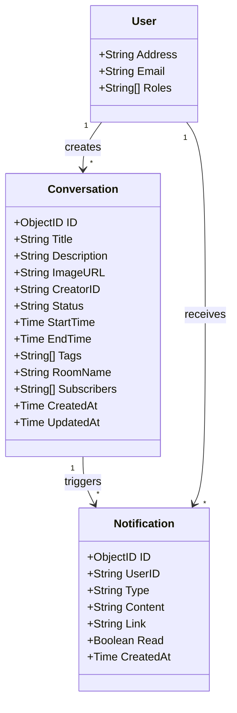
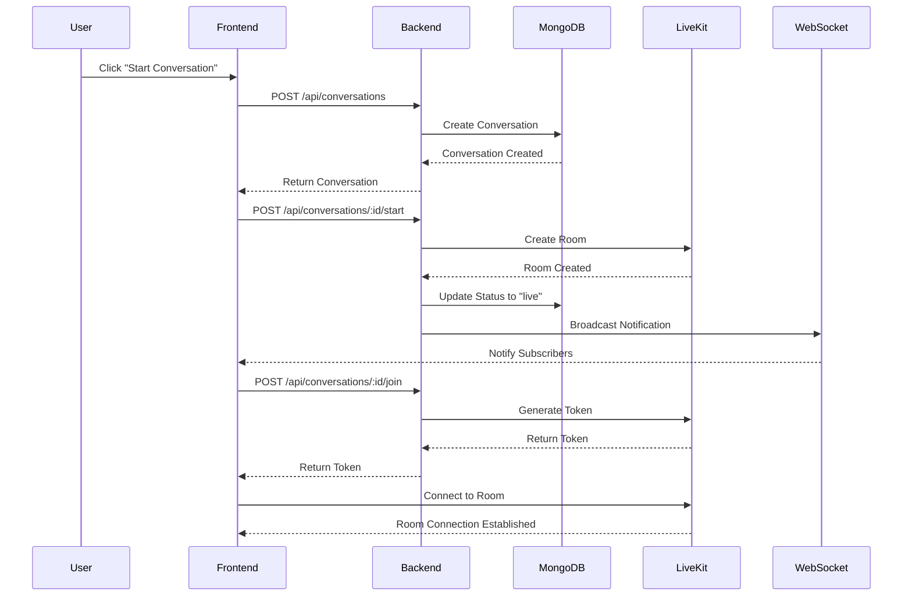
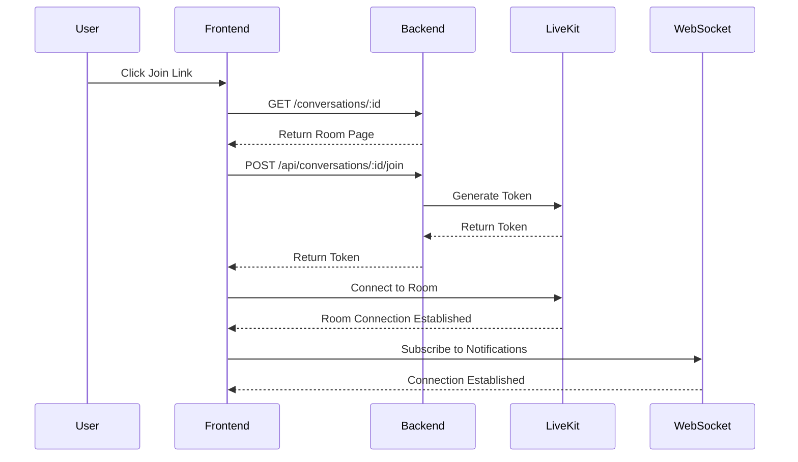

# Conversations Feature Documentation

## Overview
The conversations feature enables real-time video/audio communication between users through LiveKit integration. Users can create, join, and manage conversation rooms with features like screen sharing, participant management, and notifications.

## Entity Model



## Sequence Diagrams

### Creating and Starting a Conversation



### Joining a Conversation



## Technical Stack

### Frontend
- HTML/CSS/JavaScript
- LiveKit Client SDK
- WebSocket for real-time notifications
- Custom UI components for video/audio controls
- Toast notifications for user feedback

### Backend
- Go (Fiber framework)
- LiveKit Server SDK
- MongoDB for data persistence
- WebSocket for real-time updates
- JWT for authentication

### External Services
- LiveKit for real-time communication
- MongoDB Atlas for database
- WebSocket server for notifications

## API Endpoints

### Conversation Management
```
GET    /conversations              - Render conversations page
GET    /conversations/:id          - Render conversation room
POST   /api/conversations          - Create new conversation
GET    /api/conversations          - List conversations
GET    /api/conversations/:id      - Get conversation details
POST   /api/conversations/:id/start - Start conversation
POST   /api/conversations/:id/end   - End conversation
POST   /api/conversations/:id/join  - Generate join token
```

### Notification Management
```
GET    /api/notifications          - Get user notifications
POST   /api/notifications/:id/read - Mark notification as read
POST   /api/notifications/read-all - Mark all notifications as read
GET    /ws/notifications          - WebSocket endpoint for real-time notifications
```

## Features

### Conversation Management
- Create conversation rooms with title, description, and tags
- Schedule conversations with start time
- Start/end conversations
- Join ongoing conversations
- List conversations with filters (all, live, scheduled, ended)

### Room Features
- Real-time audio/video communication
- Screen sharing
- Participant management
- Room status indicators
- Share room link
- Participant count tracking

### Notifications
- Real-time notifications via WebSocket
- Notification types:
  - Conversation started
  - New participant joined
  - Conversation ended
  - Mention in chat
- Notification badge in navbar
- Mark notifications as read

### Security
- Authentication required for room access
- Creator-only controls for room management
- Secure token generation for LiveKit
- Environment-based configuration

## Configuration

### Environment Variables
```
LIVEKIT_HOST=your-livekit-host
LIVEKIT_API_KEY=your-api-key
LIVEKIT_API_SECRET=your-api-secret
MONGODB_URI=your-mongodb-uri
```

### LiveKit Configuration
- Room creation with unique names
- Token generation with appropriate permissions
- Participant management
- Track subscription handling

## WebSocket Events

### Server to Client
```json
{
  "type": "notification",
  "data": {
    "id": "notification-id",
    "userId": "user-address",
    "type": "conversation_started",
    "content": "Conversation 'Title' has started",
    "link": "/conversations/conversation-id",
    "createdAt": "timestamp"
  }
}
```

### Client to Server
```json
{
  "type": "subscribe",
  "data": {
    "userId": "user-address"
  }
}
```

## Error Handling
- Graceful error handling for room connection failures
- Automatic reconnection attempts
- User-friendly error messages
- Logging for debugging

## Future Improvements
1. Chat functionality within rooms
2. Recording capabilities
3. Breakout rooms
4. Room moderation tools
5. Enhanced notification preferences
6. Mobile optimization
7. Analytics and usage tracking 