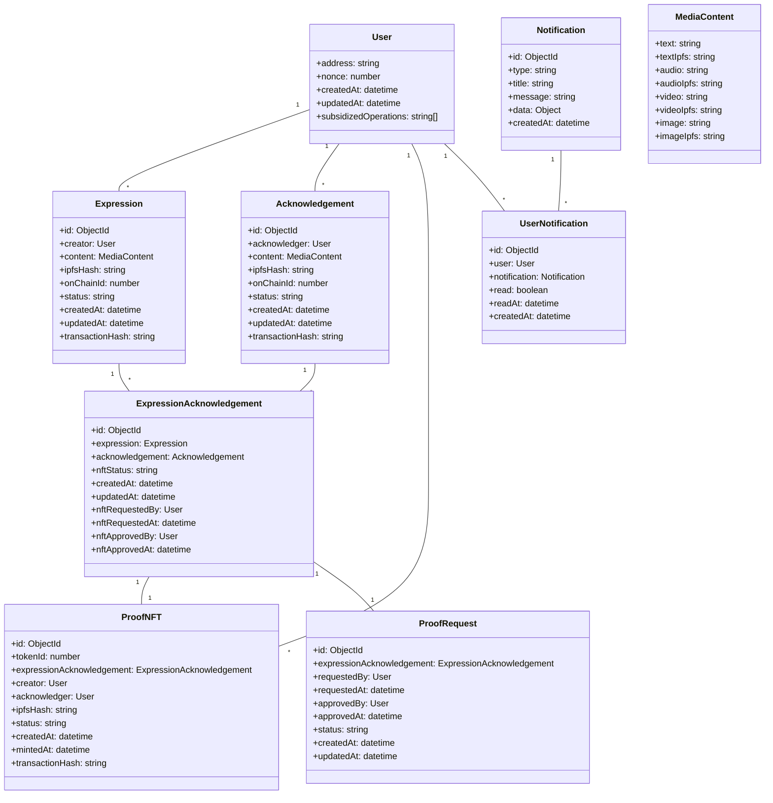
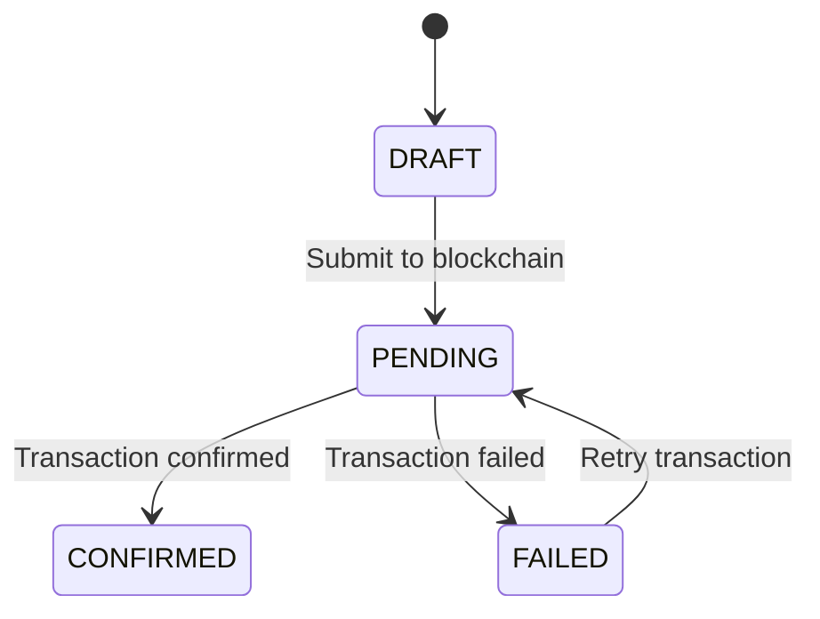
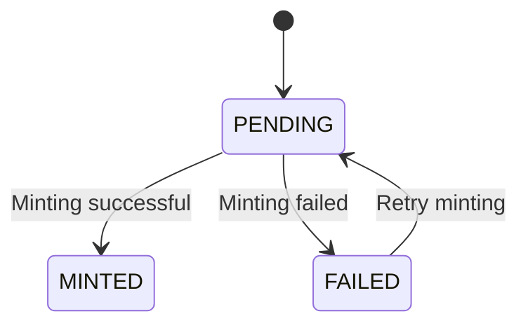
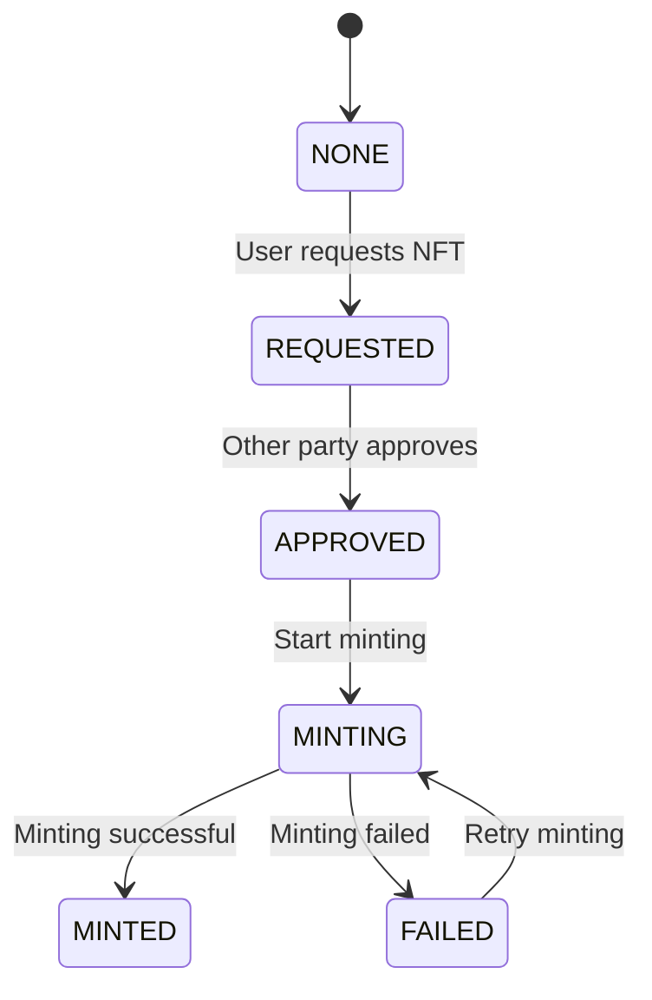
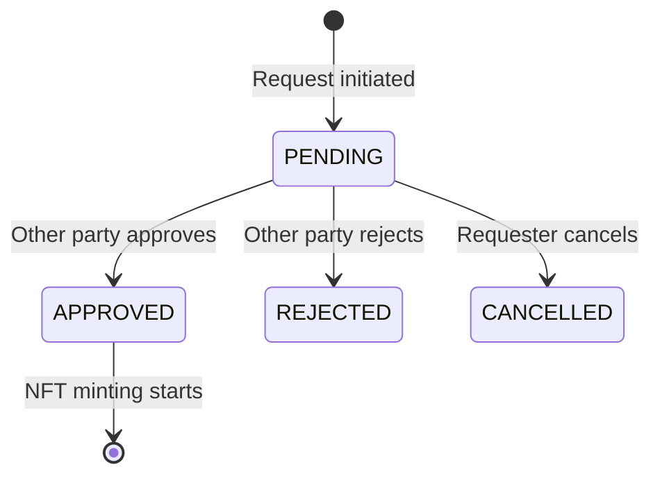

# Domain Model

## Entity Relationships



## MongoDB Schemas

### User Schema
```javascript
const UserSchema = new Schema({
    address: {
        type: String,
        required: true,
        unique: true,
        lowercase: true
    },
    nonce: {
        type: Number,
        default: () => Math.floor(Math.random() * 1000000)
    },
    subsidizedOperations: [{
        type: String,
        enum: ['EXPRESSION', 'ACKNOWLEDGEMENT', 'NFT']
    }],
    createdAt: { type: Date, default: Date.now },
    updatedAt: { type: Date, default: Date.now }
});
```

### Expression Schema
```javascript
const ExpressionSchema = new Schema({
    creator: {
        type: Schema.Types.ObjectId,
        ref: 'User',
        required: true
    },
    content: {
        text: String,
        textIpfs: String,
        audio: String,
        audioIpfs: String,
        video: String,
        videoIpfs: String,
        image: String,
        imageIpfs: String
    },
    ipfsHash: String,
    onChainId: Number,
    status: {
        type: String,
        enum: ['DRAFT', 'PENDING', 'CONFIRMED', 'FAILED'],
        default: 'DRAFT'
    },
    transactionHash: String,
    createdAt: { type: Date, default: Date.now },
    updatedAt: { type: Date, default: Date.now }
});
```

### Acknowledgement Schema
```javascript
const AcknowledgementSchema = new Schema({
    acknowledger: {
        type: Schema.Types.ObjectId,
        ref: 'User',
        required: true
    },
    content: {
        text: String,
        textIpfs: String,
        audio: String,
        audioIpfs: String,
        video: String,
        videoIpfs: String,
        image: String,
        imageIpfs: String
    },
    ipfsHash: String,
    onChainId: Number,
    status: {
        type: String,
        enum: ['DRAFT', 'PENDING', 'CONFIRMED', 'FAILED'],
        default: 'DRAFT'
    },
    transactionHash: String,
    createdAt: { type: Date, default: Date.now },
    updatedAt: { type: Date, default: Date.now }
});
```

### ExpressionAcknowledgement Schema
```javascript
const ExpressionAcknowledgementSchema = new Schema({
    expression: {
        type: Schema.Types.ObjectId,
        ref: 'Expression',
        required: true
    },
    acknowledgement: {
        type: Schema.Types.ObjectId,
        ref: 'Acknowledgement',
        required: true
    },
    nftStatus: {
        type: String,
        enum: ['NONE', 'REQUESTED', 'APPROVED', 'MINTING', 'MINTED', 'FAILED'],
        default: 'NONE'
    },
    nftRequestedBy: {
        type: Schema.Types.ObjectId,
        ref: 'User'
    },
    nftRequestedAt: Date,
    nftApprovedBy: {
        type: Schema.Types.ObjectId,
        ref: 'User'
    },
    nftApprovedAt: Date,
    createdAt: { type: Date, default: Date.now },
    updatedAt: { type: Date, default: Date.now }
});

// Compound unique index to prevent duplicate acknowledgements
ExpressionAcknowledgementSchema.index(
    { expression: 1, acknowledgement: 1 },
    { unique: true }
);
```

### ProofNFT Schema
```javascript
const ProofNFTSchema = new Schema({
    tokenId: {
        type: Number,
        required: true,
        unique: true
    },
    expressionAcknowledgement: {
        type: Schema.Types.ObjectId,
        ref: 'ExpressionAcknowledgement',
        required: true
    },
    creator: {
        type: Schema.Types.ObjectId,
        ref: 'User',
        required: true
    },
    acknowledger: {
        type: Schema.Types.ObjectId,
        ref: 'User',
        required: true
    },
    ipfsHash: String,
    status: {
        type: String,
        enum: ['PENDING', 'MINTED', 'FAILED'],
        default: 'PENDING'
    },
    createdAt: { type: Date, default: Date.now },
    mintedAt: Date,
    transactionHash: String
});
```

### Notification Schema
```javascript
const NotificationSchema = new Schema({
    type: {
        type: String,
        enum: [
            'NEW_ACKNOWLEDGEMENT',
            'PROOF_REQUEST_RECEIVED',
            'PROOF_REQUEST_APPROVED',
            'NFT_MINTED',
            'EXPRESSION_CONFIRMED',
            'ACKNOWLEDGEMENT_CONFIRMED'
        ],
        required: true
    },
    title: String,
    message: String,
    data: {
        type: Map,
        of: Schema.Types.Mixed
    },
    createdAt: { type: Date, default: Date.now }
});
```

### UserNotification Schema
```javascript
const UserNotificationSchema = new Schema({
    user: {
        type: Schema.Types.ObjectId,
        ref: 'User',
        required: true
    },
    notification: {
        type: Schema.Types.ObjectId,
        ref: 'Notification',
        required: true
    },
    read: {
        type: Boolean,
        default: false
    },
    readAt: Date,
    createdAt: { type: Date, default: Date.now }
});

// Index for quick retrieval of user's unread notifications
UserNotificationSchema.index({ user: 1, read: 1 });
```

### ProofRequest Schema
```javascript
const ProofRequestSchema = new Schema({
    expressionAcknowledgement: {
        type: Schema.Types.ObjectId,
        ref: 'ExpressionAcknowledgement',
        required: true,
        unique: true
    },
    requestedBy: {
        type: Schema.Types.ObjectId,
        ref: 'User',
        required: true
    },
    requestedAt: { type: Date, default: Date.now },
    approvedBy: {
        type: Schema.Types.ObjectId,
        ref: 'User'
    },
    approvedAt: Date,
    status: {
        type: String,
        enum: ['PENDING', 'APPROVED', 'REJECTED', 'CANCELLED'],
        default: 'PENDING'
    },
    createdAt: { type: Date, default: Date.now },
    updatedAt: { type: Date, default: Date.now }
});
```

## Status Flows

### Expression/Acknowledgement Status Flow


### NFT Status Flow


### NFT Request Status Flow


### Proof Request Status Flow
